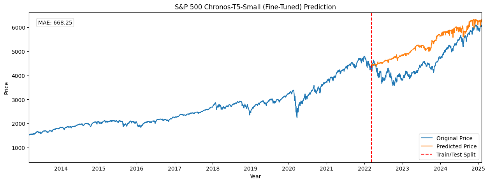
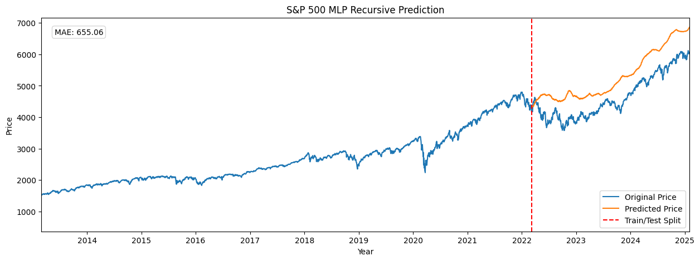
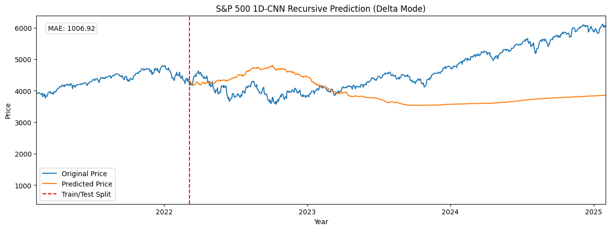

    

**Benchstreet** is a curated collection of time series prediction models designed to help developers evaluate and compare the performance of different approaches in **one-shot**, **long-term** financial data forecasting.

The models are trained on 20 years of S&P 500 daily closing prices provided by [Investing.com](https://investing.com/indices/us-spx-500-historical-data).

> [!IMPORTANT]
> This is not an objective benchmark! It's intended as a qualitative guide and a reference on how to implement these models.

### Table of Contents

| Model Type                           |                                                       |
|--------------------------------------|-------------------------------------------------------|
| Transformer/Foundation Models        | TimesFM ([baseline](#timesfm-baseline) • [**fine-tuned**](#timesfm-fine-tuned)), Chronos ([baseline](#chronos-baseline) • [**fine-tuned**](#chronos-fine-tuned)) |
| Feedforward Neural Networks (FNNs)   | MLP ([recursive](#mlp-recursive) • [vector](#mlp-vector)), N-BEATS ([direct](#n-beats)) |
| Convolutional Neural Networks (CNNs) | 1D-CNN ([recursive](#1d-cnn-recursive) • [vector](#1d-cnn-vector)), TemporalCN ([vector](#temporalcn)) |
| Recurrent Neural Networks (RNNs)     | LSTM ([recursive](#lstm-recursive) • [vector](#lstm-vector) • [encoder-decoder](#lstm-encoder-decoder)), GRU ([recursive](#gru-recursive) • [vector](#gru-vector)) |
| Statistical Models                   | ARIMA ([recursive](#arima)), SARIMAX ([vector](#sarimax)), FBProphet ([direct](#fbprophet)) |

Want a model added to this list? Raise an issue [here](https://github.com/puffinsoft/benchstreet/issues) or [make a PR](https://github.com/puffinsoft/benchstreet/pulls)!

> [!TIP]
> **The winner**: [N-BEATS](#n-beats). High accuracy with extremely low training time.

### TimesFM

#### timesfm-baseline

[`timesfm/baseline.py`](benchstreet/timesfm/baseline.py)

view magnified graph

#### timesfm-fine-tuned

[`timesfm/fine_tune.ipynb`](benchstreet/timesfm/fine_tune.ipynb) • [download on huggingface 🤗](https://huggingface.co/ColonelParrot/benchstreet-timesfm-2.0-500m-torch-sp500)

view magnified graph

### Chronos

#### chronos-baseline

[`chronos/baseline.py`](benchstreet/chronos/baseline.py)

view magnified graph

#### chronos-fine-tuned

[`chronos/fine_tune.ipynb`](benchstreet/chronos/fine_tune.ipynb) • [download on huggingface 🤗](https://huggingface.co/ColonelParrot/benchstreet-chronos-t5-small-sp500)

view magnified graph

### MLP

#### mlp-recursive

[`mlp/recursive.py`](benchstreet/mlp/recursive.py)

view magnified graph

#### mlp-vector

[`mlp/vector.py`](benchstreet/mlp/vector.py)

view magnified graph

### N-BEATS

[`n_beats/direct.py`](benchstreet/n_beats/direct.py)

view magnified graph

### 1D-CNN

#### 1d-cnn-recursive

[`cnn/recursive.py`](benchstreet/cnn/recursive.py)

view magnified graph

#### 1d-cnn-vector

[`cnn/vector.py`](benchstreet/cnn/vector.py)

view magnified graph

### TemporalCN

[`tcn/vector.py`](benchstreet/tcn/vector.py)

view magnified graph

### LSTM

#### lstm-recursive

[`lstm/recursive.py`](benchstreet/lstm/recursive.py)

view magnified graph

#### lstm-vector

[`lstm/vector.py`](benchstreet/lstm/vector.py)

view magnified graph

#### lstm-encoder-decoder

[`lstm/encdec.py`](benchstreet/lstm/encdec.py)

view magnified graph

### GRU

#### gru-recursive

[`gru/recursive.py`](benchstreet/gru/recursive.py)

view magnified graph

#### gru-vector

[`gru/vector.py`](benchstreet/gru/vector.py)

view magnified graph

### ARIMA

[`arima/recursive.py`](benchstreet/arima/recursive.py)

view magnified graph

### SARIMAX

[`sarimax/direct.ipynb`](benchstreet/sarimax/direct.ipynb)

view magnified graph

### FBProphet

[`fbprophet/direct.py`](benchstreet/fbprophet/direct.py)

view magnified graph

Want a model added to this list? Raise an issue [here](https://github.com/puffinsoft/benchstreet/issues) or [make a PR](https://github.com/puffinsoft/benchstreet/pulls)!